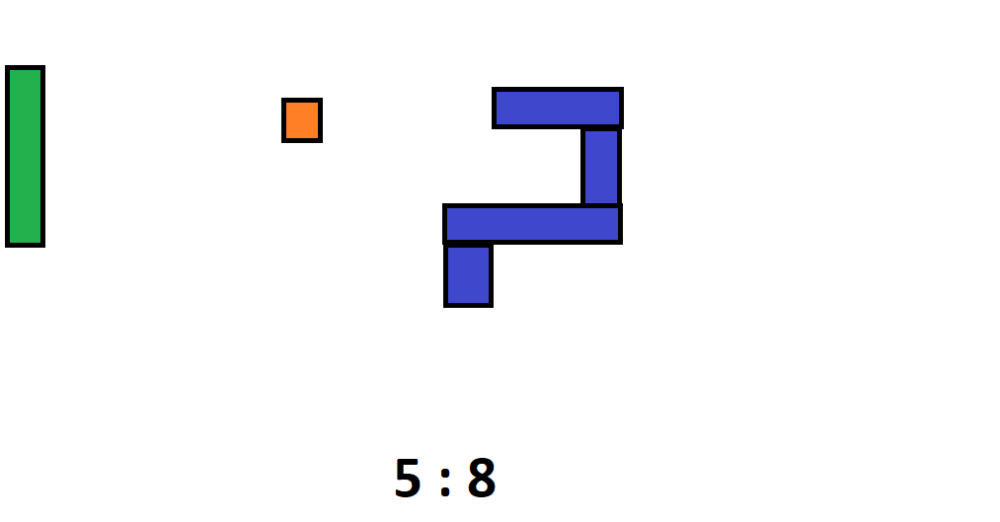
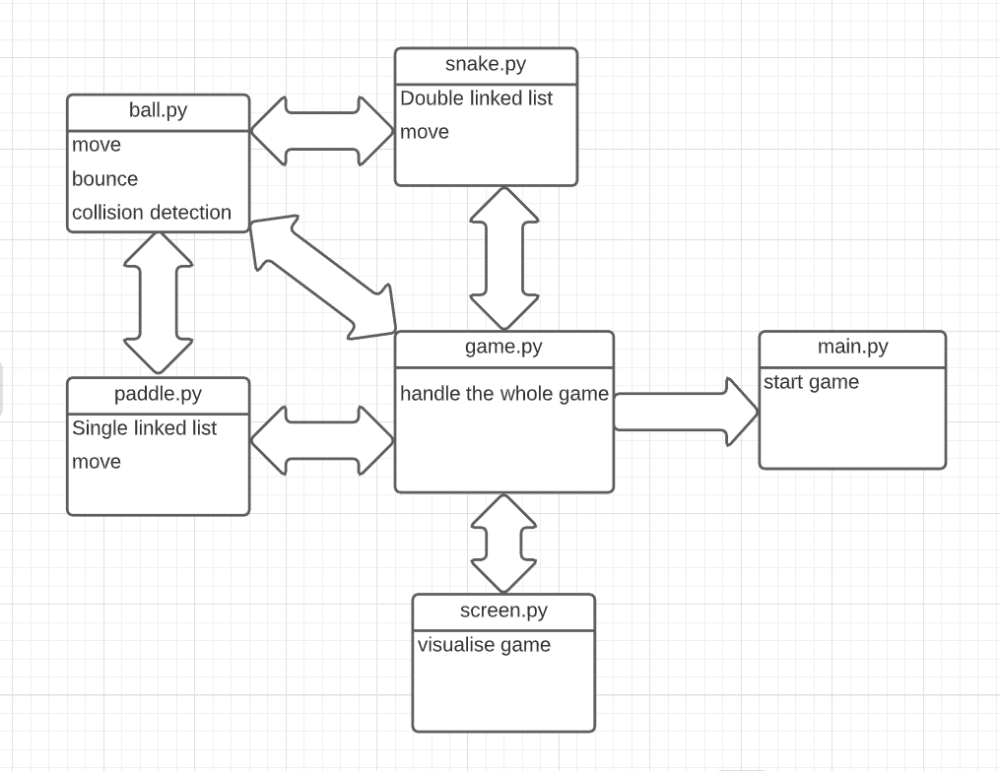

# SnakePong
Snakepong is a mix between the old games "pong" & "snake", where the game is played like pong but one of the paddles of pong can be controlled like snake. 
Since this is a task and not a replacement for the exam, I will only work on this for 1 day.

## Analysis of the problem
It is a pretty complex game, using bounce physics on the ball, is also has 2 big moveable parts: the snake and the paddle. 
The components are:
- screen
- paddle
- snake
- ball
- points

## Scheme
This is a guess of the code that will be needed and a scheme of how they would interact.

Code:
- main.py: Just start the game
- game.py: handle everything in the game
- screen.py: visualize the game
- snake.py: move(Double linked list)
- paddle.py: move(Single linked list)
- ball.py: move(bounce-physics, collision detection)

Scheme:

## Documentation

This is too difficult of a task for me, I would just watch a tutorial and copy that because I don't know how to make this. So I will make what I know, it will be more like snake: the berry will spawn at random coordinates and the snake will only be a head , i will try to make the snake move with keyboard input and even make a simple algorithm(it will just look where the berry is and go there), this course is called Algorithms after all. I will also try to make pytests for these.

My snake concept:
- works in a game loop
- it keeps moving in the same direction until another direction gets called by user or AI, like normal snake
- takes in user input : Z=UP, S= DOWN, Q=LEFT, D=RIGHT
- a simple AI that plays the game for you (Algorithm)
- it is visualized by showing the coordinates of snake and the berry
- when snake is on a berry, you get a point and the berry will spawn again at a random location
- the playable area is for both X & Y 0-20, if you go outside that you die
- has pytests for the random berry location, the snake movement and the AI

For the tests to works you have to put the game loop in comment, because the tests get stuck there.

## Used links

- Keyboard input: (https://stackoverflow.com/questions/24072790/detect-key-press-in-python )
- RNG: (https://www.w3schools.com/python/ref_random_randint.asp )
- Fix for input error: (https://stackoverflow.com/questions/11844072/python-typeerror-cannot-concatenate-str-and-int-objects )
- Course: (https://devbit-algorithms.netlify.app/#course-goals )